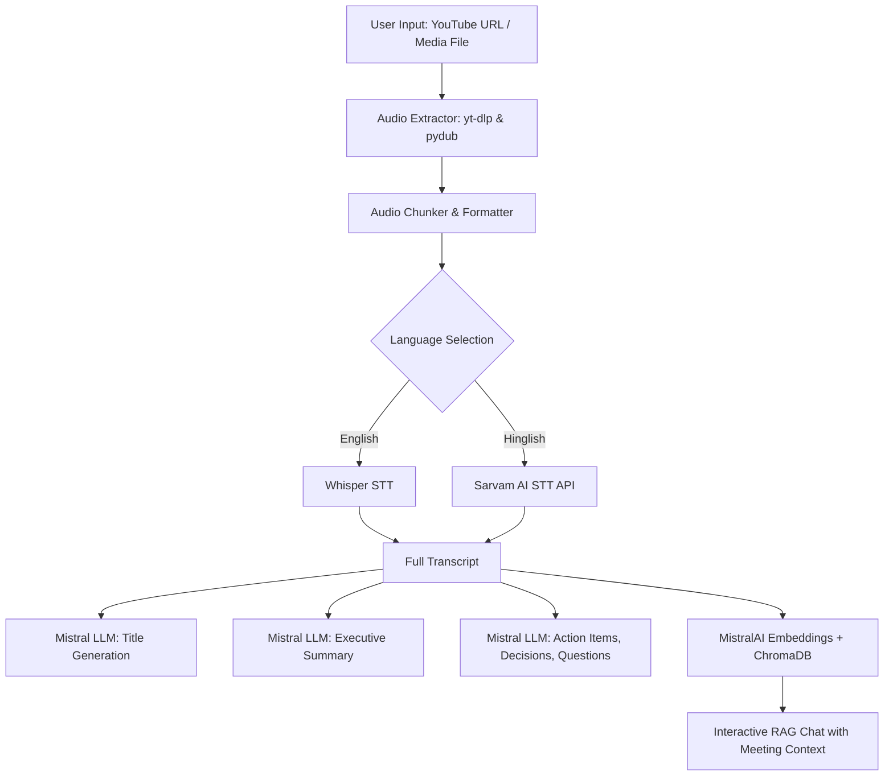

# 🎙️ MOM — AI Video Assistant (Minutes of Meeting AI)

[](https://meeting-assistant-mom.streamlit.app/)
[](https://www.python.org/downloads/)
[](https://python.langchain.com/)
[](https://mistral.ai/)
[](https://www.trychroma.com/)

**MOM** is an end-to-end AI-powered meeting and video assistant that transforms audio/video recordings and YouTube lectures into structured knowledge, executive summaries, actionable insights, and an interactive RAG conversational search engine.

🔗 **Live Demo:** [https://meeting-assistant-mom.streamlit.app/](https://meeting-assistant-mom.streamlit.app/)

---

## 🌟 Key Features

- 📥 **Universal Media Ingestion**: Drop local audio/video files (`mp4`, `mov`, `webm`, `mp3`, `wav`, `m4a`, `ogg`, `flac`) or paste any YouTube URL.
- ⚡ **Dual Speech-to-Text Engines**:
  - **OpenAI Whisper**: High-accuracy local speech transcription for English & global languages.
  - **Sarvam AI (`saaras:v2.5`)**: Specialized Indic speech transcription optimized for **Hinglish** & Indian accents.
- 📋 **Executive Summaries**: Synthesizes hours of meeting recordings into concise, high-impact executive summaries.
- 🔍 **Automated Insight Extraction**:
  - ✅ **Action Items**: Extracts assigned tasks, owners, and deliverables.
  - 🔑 **Key Decisions**: Pinpoints consensus points and strategic choices made.
  - ❓ **Open Questions**: Tracks unresolved questions and discussions for next steps.
- 💬 **RAG Q&A Chat ("Ask MOM")**: Talk directly with your meeting transcripts using Retrieval-Augmented Generation powered by ChromaDB vector search and Mistral AI embeddings.
- 🎨 **Modern Streamlit Interface**: Clean, accessible, high-contrast dashboard with real-time pipeline tracking.

---

## 🏗️ Architecture & Pipeline



---

## 📂 Project Structure

```
aivideoassistant/
├── core/
│   ├── transcriber.py       # Whisper & Sarvam AI STT engine
│   ├── summarize.py         # Mistral AI summarization & title generation
│   ├── extractor.py         # Action items, key decisions, questions extraction
│   ├── vector_Store.py      # ChromaDB + MistralAIEmbeddings indexer
│   └── rag_engine.py        # LangChain LCEL RAG QA chain
├── utils/
│   └── audio_processor.py   # yt-dlp downloading, pydub audio chunking & conversion
├── .streamlit/
│   └── config.toml          # Streamlit server and file watcher settings
├── app.py                   # Streamlit web application & UI dashboard
├── main.py                  # CLI & script runner entrypoint
├── packages.txt             # Linux system dependencies (ffmpeg)
├── requirements.txt         # Python project dependencies
├── .env.example             # Template for API keys
└── README.md                # Project documentation
```

---

## 🚀 Getting Started

### 1. Clone the Repository
```bash
git clone https://github.com/samadhanmane/MOM-ai.git
cd MOM-ai
```

### 2. Create and Activate Virtual Environment
```bash
# Windows
python -m venv .venv
.venv\Scripts\activate

# macOS / Linux
python3 -m venv .venv
source .venv/bin/activate
```

### 3. Install Dependencies
```bash
pip install -r requirements.txt
```

> **Note on FFmpeg**: Ensure `ffmpeg` is installed on your machine and accessible in your system `PATH`. On Ubuntu/Debian: `sudo apt install ffmpeg`, on macOS: `brew install ffmpeg`, on Windows: `winget install Gyan.FFmpeg` or download from [ffmpeg.org](https://ffmpeg.org/).

### 4. Configure Environment Variables
Create a `.env` file in the root directory:
```env
MISTRAL_API_KEY="your_mistral_api_key"
SARVAM_API_KEY="your_sarvam_api_key"      # Optional: Required only for Hinglish STT
WHISPER_MODEL="small"                      # Options: tiny, base, small, medium, large
SARVAM_SST_MODEL="saaras:v2.5"
```

### 5. Run the Application
```bash
streamlit run app.py
```
Open your browser at `http://localhost:8501`.

---

## 🛠️ Tech Stack

| Component | Technology |
|---|---|
| **Frontend & UI** | Streamlit, Custom CSS |
| **LLM & Embeddings** | Mistral AI (`mistral-large-latest`, `mistral-embed`) |
| **Orchestration** | LangChain (LCEL) |
| **Vector Database** | ChromaDB (`langchain-chroma`) |
| **Speech-to-Text** | OpenAI Whisper, Sarvam AI API |
| **Audio Processing** | `yt-dlp`, `pydub`, `ffmpeg` |

---

## 🌐 Deployment on Streamlit Cloud

1. Fork or push this repository to GitHub.
2. Go to [share.streamlit.io](https://share.streamlit.io/) and create a new app.
3. Select your repository, branch `main`, and main file `app.py`.
4. In **App Settings > Secrets**, add your API keys:
   ```toml
   MISTRAL_API_KEY = "your_mistral_api_key"
   SARVAM_API_KEY = "your_sarvam_api_key"
   ```
5. Deploy! Streamlit will automatically read `packages.txt` for `ffmpeg` and `requirements.txt` for Python dependencies.

---

## 📄 License
This project is open-source and available under the [MIT License](LICENSE).
